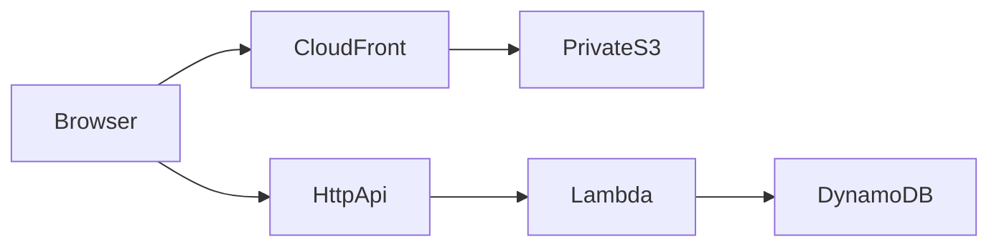

# URL shortener

A signed-in user creates and manages short links in a React dashboard. Anyone with a short code can open it: the API answers `GET /{shortCode}` with a 302 to the original URL.

The dashboard is a static site. The API is one Lambda function. Terraform creates both in AWS `us-east-1`, and GitHub Actions publishes changes when they land on `main`.

| Path | What it is |
| --- | --- |
| [`frontend/`](frontend/) | React dashboard. Builds to static files. |
| [`backend/`](backend/) | TypeScript API. Domain, use cases, DynamoDB, and the Lambda handler. |
| [`terraform/`](terraform/) | DynamoDB, Lambda, HTTP API, and the S3/CloudFront site. |
| [`.github/workflows/`](.github/workflows/) | Plan, apply, and deploy jobs. |

Setup commands live in the package READMEs: [frontend](frontend/README.md), [backend](backend/README.md), and [infrastructure](terraform/README.md).

## Frontend

### Tech stack

The app is a Vite single-page application. It does not need a Node server after `npm run build`. The production artifact is `frontend/dist`.

| Piece | Role |
| --- | --- |
| React 19 | UI |
| Vite 8 | Dev server and production build |
| TypeScript | Types |
| React Router 7 | Client routes |
| Tailwind CSS 4 | Styling |
| Vitest and Testing Library | Tests |
| ESLint and Prettier | Lint and format |
| Node.js 22 | Local and CI toolchain |

The only runtime configuration is `VITE_API_BASE_URL`. In production that value is the API Gateway invoke URL, baked in at build time. The JWT signing secret never appears in a `VITE_*` variable.

### Architecture

Code is split by responsibility under `frontend/src/`:

| Folder | Responsibility |
| --- | --- |
| `app/` | `BrowserRouter`, auth and toast providers, route table |
| `pages/` | Sign-in, sign-up, dashboard, and not-found screens |
| `features/auth/` | Session, route guards, form validation |
| `features/urls/` | List state and URL form validation |
| `components/` | Layout, auth forms, URL widgets, and shared UI |
| `services/api/` | HTTP client, auth calls, and URL calls |
| `config/env.ts` | Reads and checks `VITE_API_BASE_URL` |

`App` wraps the router in `AuthProvider` and `ToastProvider`. `AuthProvider` builds one API client and the auth and URL helpers from it.

Routes:

| Path | Who can open it |
| --- | --- |
| `/` | Redirects to `/dashboard` |
| `/signin`, `/signup` | Guests. A signed-in user is sent to the dashboard. |
| `/dashboard` | Signed-in users. Everyone else is sent to sign-in. |
| Anything else | Not-found page |

Authentication uses an access token stored in `localStorage`. The API client sends it as `Authorization: Bearer <token>`. A 401 clears the session. Logout deletes the token in the browser. It does not call the API, because the token stays valid until it expires.

Local development and production reach the API differently:

- In dev, the client uses a relative base URL. The Vite server proxies `/auth` and `/urls` to `VITE_API_BASE_URL`.
- In a production build, the client calls `VITE_API_BASE_URL` directly.

CloudFront serves the built files and rewrites missing paths to `index.html`, so a refresh on `/dashboard` still loads the app. Short links are not served from that site. They are requested on the API host.

## Backend

### Tech stack

The API is TypeScript on Node.js 20. It runs as a Lambda function behind API Gateway HTTP API (payload format 2.0). The handler is `dist/lambda/handler.handler`.

| Piece | Role |
| --- | --- |
| Zod | Request validation at the boundary |
| `jose` | HS256 access tokens |
| `bcryptjs` | Password hashes (cost 10) |
| AWS SDK v3 | DynamoDB document client |
| Vitest | Unit tests, plus optional tests against a real table |
| ESLint and Prettier | Lint and format |

Use cases are functions, not classes. Expected failures are returned as a `Result` value. The handler maps that value to an HTTP status. Storage and unexpected failures are logged and returned as a generic 500. Clients never receive password hashes, the JWT secret, AWS errors, or stack traces.

### Architecture

Dependencies point inward. Application code depends on repository ports, not on DynamoDB. Adapters are constructed in `src/composition.ts` and `src/lambda/dependencies.ts`, once per Lambda container.

```text
src/lambda/            HTTP: routes, auth check, JSON and redirect responses
    │
src/application/       Use cases: sign-up, sign-in, create, list, resolve, delete
    │
src/domain/            Records, errors, UrlRepository and UserRepository ports
    │
src/infrastructure/    DynamoDB client and the two adapters
```

`src/validation/` checks unknown input with Zod before a use case does any work. Only `http:` and `https:` URLs with a host are accepted, up to 2048 characters. `src/utils/short-code.ts` draws a 7-character code from a 62-character alphabet. If the code is already taken, the create use case tries again, up to five times.

An in-memory URL repository exists for the local demo and unit tests. Production and the Lambda use the DynamoDB adapters.

### Authentication

Sign-up stores the email and a bcrypt hash. Sign-in returns a JWT that expires after one hour. The payload is `sub` (the user id) plus `iat` and `exp`. The signing secret is `JWT_SECRET` and must be at least 32 characters.

Protected routes read the user id from that token. A `userId` field in the body is ignored. There is no server-side revocation: deleting the token in the browser stops that browser from sending it, and an already issued token remains valid until it expires.

### HTTP API

| Route | Access | Success |
| --- | --- | --- |
| `POST /auth/signup` | Public | `201` |
| `POST /auth/signin` | Public | `200` with `accessToken` and the user |
| `GET /auth/me` | Authenticated | `200` with the current user |
| `POST /urls` | Authenticated | `201` with `shortCode` and `originalUrl` |
| `GET /urls` | Authenticated | `200` with that user's links, newest first |
| `GET /urls/{shortCode}` | Authenticated | `200` if the caller owns the link |
| `DELETE /urls/{shortCode}` | Authenticated | `204` if the caller owns the link |
| `GET /{shortCode}` | Public | `302` to the original URL |

Invalid input is `400`. A bad or missing token, or a bad email and password, is `401`. An unknown code, or a link the caller does not own, is `404`. A duplicate email or a short-code collision that survives the retry limit is `409`. CORS allows only the `FRONTEND_URL` origin. `Access-Control-Allow-Origin` is never `*`.

### DynamoDB

Billing is on-demand. The tables are separate. This project does not use a single-table design.

| Table | Partition key | Index |
| --- | --- | --- |
| `url-shortener` | `shortCode` | `UserUrlsIndex` on `userId` and `createdAt` |
| `url-shortener-users` | `userId` | `EmailIndex` on `email` |

`GET /urls` queries `UserUrlsIndex`. It does not scan the table. Saving a URL uses a condition so an existing short code is not overwritten. Email lookup uses `EmailIndex`.

The Lambda role can `GetItem`, `PutItem`, `Query`, and `DeleteItem` on these tables and their indexes. Credentials are not stored in the code. Locally the AWS SDK default chain is used. On Lambda the function execution role is used.

## Deployment



Page loads stay on CloudFront. API calls and public short-link redirects go to API Gateway, then Lambda, then DynamoDB.

Terraform in `terraform/environments/prod/` is the source of truth for the application stack. It wires three modules:

- **DynamoDB.** The URLs table and the users table above. Both set `prevent_destroy`.
- **API Lambda.** Node.js 20, the HTTP API, the route keys, and the function environment: `DYNAMODB_TABLE_NAME`, `USERS_TABLE_NAME`, `JWT_SECRET`, and `FRONTEND_URL`. `FRONTEND_URL` is the CloudFront URL. Lambda sets `AWS_REGION` itself, so Terraform does not pass it.
- **Static site.** A private S3 bucket and a CloudFront distribution with origin access control. The viewer is redirected to HTTPS. Responses of 403 and 404 are rewritten to `200 /index.html` so client routes keep working.

`terraform/bootstrap/` is applied once from a laptop. It creates the S3 bucket for Terraform state and the DynamoDB lock table `terraform-locks`. Day-to-day applies use that remote state. The state bucket stays private because it holds `JWT_SECRET`.

### GitHub Actions

A push to `main` runs only the workflow whose paths changed. Apply and deploy jobs use the GitHub environment `production`. Each has its own concurrency group, and the DynamoDB lock table stops two applies from writing state at the same time.

| Workflow | When | What it does |
| --- | --- | --- |
| `terraform-plan.yml` | Pull request touching `terraform/**` or `backend/**` | Builds the Lambda zip, runs `terraform plan`, writes the plan to the job summary. Does not change AWS. |
| `terraform-apply.yml` | Push to `main` touching `terraform/**` | Packages the Lambda zip and runs `terraform apply`. |
| `deploy-backend.yml` | Push to `main` touching `backend/**` | Runs typecheck, lint, and tests on Node 20. Then builds `backend/url-shortener-lambda.zip` and runs `terraform apply`. |
| `deploy-frontend.yml` | Push to `main` touching `frontend/**` | Runs typecheck, lint, and tests on Node 22. Builds with `VITE_API_BASE_URL` set from the `api_invoke_url` output, syncs `frontend/dist` to the site bucket with `--delete`, and invalidates CloudFront. |

Backend code is published through Terraform, not through a separate Lambda update call. `backend/scripts/package-lambda.sh` compiles TypeScript, installs production dependencies, and writes the zip. The function resource hashes that zip. When the hash changes, apply updates the function code.

The frontend deploy job reads Terraform outputs and uploads files. It does not apply the stack.

Required GitHub settings:

| Name | Kind |
| --- | --- |
| `AWS_ACCESS_KEY_ID` | Secret |
| `AWS_SECRET_ACCESS_KEY` | Secret |
| `TF_VAR_jwt_secret` | Secret, at least 32 characters |
| `TF_STATE_BUCKET` | Repository variable, from the bootstrap output |

Changing `TF_VAR_jwt_secret` signs out every existing token.

## Local development

Copy each example env file and fill it in. `frontend/.env.example` needs `VITE_API_BASE_URL`. `backend/.env.example` needs the table names, `JWT_SECRET`, and `FRONTEND_URL=http://localhost:5173` so local CORS matches the Vite origin.

Install, scripts, tests, and the Terraform apply steps are in [frontend/README.md](frontend/README.md), [backend/README.md](backend/README.md), and [terraform/README.md](terraform/README.md).
