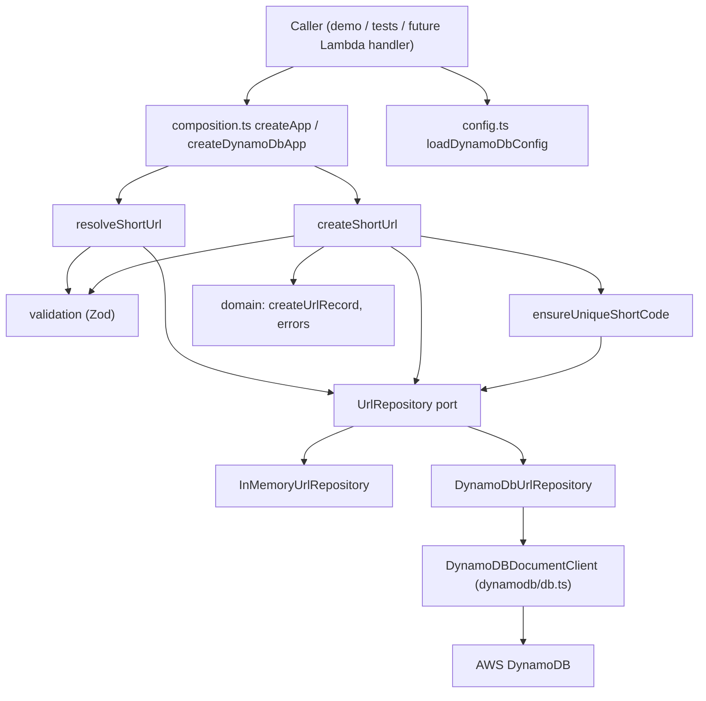

# URL Shortener Backend

A small, functional TypeScript backend for creating and resolving short URLs. It contains the
domain and application logic and two storage implementations: an in-memory repository (used by
unit tests and the default demo) and a DynamoDB repository (used for integration testing and
production). AWS Lambda and API Gateway come next and will not require business-logic changes.

## Architecture



Dependencies point inward. The application layer depends on the `UrlRepository` type, never on a
concrete implementation. Concrete infrastructure is only wired together in `composition.ts`.

## Project structure

```text
src/
├── domain/
│   ├── url.ts                  UrlRecord type + pure createUrlRecord
│   ├── errors.ts               Error union + constructors
│   └── url-repository.ts       UrlRepository port (type only)
├── application/
│   ├── create-short-url.ts     Use case: validate -> unique code -> record -> save
│   ├── resolve-short-url.ts    Use case: validate -> lookup -> originalUrl
│   └── ensure-unique-short-code.ts  Bounded collision retry
├── infrastructure/
│   ├── dynamodb/
│   │   └── db.ts               createDynamoDbDocumentClient factory
│   └── repositories/
│       ├── in-memory-url-repository.ts
│       └── dynamodb-url-repository.ts
├── validation/
│   └── url-schema.ts           Zod schemas + validate* functions
├── shared/
│   └── result.ts               Result<T, E>, ok, err
├── utils/
│   ├── short-code.ts           Injectable short-code generator
│   └── clock.ts                Clock type, systemClock, fixedClock
├── lambda/
│   ├── handler.ts              Lambda entry point (dist/lambda/handler.handler)
│   ├── create-handler.ts       Routing, body parsing, result-to-HTTP mapping
│   ├── response.ts             Pure JSON response helpers and error mapping
│   └── dependencies.ts         Builds DynamoDB-backed use cases from the environment
├── config.ts                   Reads and validates environment variables
├── composition.ts              createApp / createDynamoDbApp: wire dependencies
├── demo.ts                     Runnable example (npm run dev, npm run demo:dynamodb)
└── index.ts                    Public exports

tests/                          Mirrors src/, plus helpers/ (fakes, fake DynamoDB client)
└── integration/                Optional tests against a real DynamoDB table
```

## Getting started

Requires Node.js 20 or newer.

```bash
npm install
npm run dev            # runs src/demo.ts with the in-memory repository, in watch mode
npm run demo:dynamodb  # runs the same demo against a real DynamoDB table (see below)
```

## Tests, lint, and type checks

```bash
npm run test         # watch mode
npm run test:run     # single run, no AWS access needed
npm run test:coverage
npm run test:integration  # optional, needs AWS credentials and a table
npm run lint
npm run format       # or format:check
npm run typecheck
npm run build        # emits dist/
```

## Example usage

```ts
import { createApp } from "./src/index.js";

const app = createApp();

const created = await app.createShortUrl({ url: "https://example.com/some/long/path" });
if (created.success) {
  // { shortCode: "a8Kx92h", originalUrl: "https://example.com/some/long/path", createdAt: "..." }
  const resolved = await app.resolveShortUrl(created.value.shortCode);
  // { success: true, value: { originalUrl: "https://example.com/some/long/path" } }
} else {
  // created.error.type: "InvalidUrl" | "ShortCodeGeneration" | "Repository"
}
```

Using a use case directly with deterministic dependencies (as the tests do):

```ts
const result = await createShortUrl({
  repository: createInMemoryUrlRepository(),
  generateShortCode: () => "abc123",
  now: fixedClock("2026-09-27T16:00:00.000Z"),
})({ url: "https://example.com" });
```

## Design decisions

- **Functions over classes.** Use cases are curried factories: `useCase(deps)(input)`. You
  supply dependencies once (for example at Lambda cold start) and call the returned function
  for each request. An ESLint rule forbids class declarations.
- **Explicit `Result<T, E>`.** Every expected failure is returned as a value, never thrown.
  Errors are a discriminated union (`type` field) of plain objects: `InvalidUrl`,
  `InvalidShortCode`, `UrlNotFound`, `ShortCodeGeneration`, and `Repository`. The compiler
  forces callers to handle failures, and tests can compare them with plain `toEqual`. Code only
  throws for programmer errors, such as configuring a short-code length that is not a positive
  integer.
- **Safe error messages.** `RepositoryError` always has the generic message "A storage error
  occurred". The underlying cause is kept in `cause` for logging and should never be sent to
  clients.
- **Validation at the boundary.** Use cases accept `unknown` input and check it with Zod
  before doing any work. Only `http:` and `https:` URLs with a host are accepted, up to 2048
  characters. The URL is parsed with the WHATWG `URL` parser, so strings like `example.com`,
  `hello`, or `javascript:...` are rejected.
- **Injected randomness and time.** `createShortCodeGenerator({ randomInt })` and `Clock` let
  tests be fully deterministic. The production generator uses `node:crypto.randomInt` over a
  62-character alphanumeric alphabet. The default length is 7, which gives about 3.5 trillion
  codes.
- **Bounded collision handling.** `ensureUniqueShortCode` tries up to `maxAttempts` codes
  (default `MAX_GENERATION_ATTEMPTS = 5`) and then returns a `ShortCodeGeneration` error.
- **Immutability.** Domain records are frozen. The in-memory repository stores frozen copies,
  and its `Map` is the only mutable state in the codebase. Each repository instance has its own
  private `Map`. There is no module-level DynamoDB client; one is created per `createDynamoDbApp`
  call.

## Repository abstraction

```ts
type UrlRepository = {
  save: (record: UrlRecord) => Promise<Result<void, RepositoryError>>;
  findByShortCode: (
    shortCode: string,
  ) => Promise<Result<UrlRecord | null, RepositoryError>>;
};
```

The use cases only see this type. Implementations must not throw. They catch infrastructure
failures and return `err(repositoryError(cause))`. Because the port uses domain types only,
storage-specific details such as AWS SDK commands and errors stay inside the adapter.

## Authentication

Signup and sign-in use email and password. Passwords are stored only as bcrypt hashes
(`bcryptjs`, cost 10). A successful sign-in returns a JWT access token that expires after one
hour. The payload is `sub` (the user id) plus `iat` and `exp`. The signing secret is
`JWT_SECRET` and is never sent to the frontend.

Protected routes read `Authorization: Bearer <token>`. The user id always comes from that
token. A `userId` field in the request body is ignored.

Logout does not call the API. JWTs are stateless: deleting the token in the browser stops that
browser from sending it, but an already issued token stays valid until it expires. There is no
server-side revocation.

`localStorage` on the frontend can be stolen if the page has an XSS bug. A stricter production
setup would use secure HttpOnly cookies and CSRF protection. This app does not claim the
`localStorage` approach is fully secure.

## Lambda HTTP API

`src/lambda/handler.ts` exports `handler` for API Gateway HTTP API (payload format 2.0). The
handler parses the request, checks auth where required, calls a use case, and maps the result
to a response. Dependencies are built once per container at cold start.

| Route                      | Access        | Success                                                 |
| -------------------------- | ------------- | ------------------------------------------------------- |
| `POST /auth/signup`        | Public        | `201 { message }`                                       |
| `POST /auth/signin`        | Public        | `200 { accessToken, user: { userId, email } }`          |
| `GET /auth/me`             | Authenticated | `200 { user: { userId, email } }`                       |
| `POST /urls`               | Authenticated | `201 { shortCode, originalUrl }`                        |
| `GET /urls`                | Authenticated | `200 { count, items }` for that user only, newest first |
| `GET /urls/{shortCode}`    | Authenticated | `200 { shortCode, originalUrl }` if the caller owns it  |
| `DELETE /urls/{shortCode}` | Authenticated | `204` if the caller owns it                             |
| `GET /{shortCode}`         | Public        | `302` to the original URL                               |

Declare every route key in API Gateway. Any other route returns `404 { "error": "Route not found" }`.

Responses include CORS headers for the `FRONTEND_URL` origin. `Access-Control-Allow-Origin` is
never `*`. `OPTIONS` returns `204` with the same CORS headers.

| Condition                                                                 | Status                    |
| ------------------------------------------------------------------------- | ------------------------- |
| Missing or invalid auth on a protected route                              | 401                       |
| Invalid email or password (same message either way)                       | 401                       |
| Missing body, malformed JSON, invalid URL, missing or invalid code        | 400                       |
| Auth field validation                                                     | 400 `{ message, errors }` |
| Unknown short code, or a URL the caller does not own                      | 404                       |
| Duplicate email                                                           | 409                       |
| Duplicate short code, or no unique code after the retry limit             | 409                       |
| Storage failure or any unexpected exception (logged with `console.error`) | 500                       |

URL error bodies are `{ "error": string, "details"?: string[] }`. Auth error bodies are
`{ "message": string }`. Neither includes password hashes, the JWT secret, AWS errors, or stack
traces.

## DynamoDB

### URLs table

Existing table. String partition key `shortCode`, no sort key. Add a GSI named `UserUrlsIndex`
(do not recreate the table):

- Partition key `userId` (String)
- Sort key `createdAt` (String)
- Projection ALL

```json
{
  "shortCode": "a8Kx92h",
  "originalUrl": "https://example.com/some/path",
  "userId": "user-uuid",
  "createdAt": "2026-09-28T00:00:00.000Z"
}
```

`GET /urls` queries `UserUrlsIndex`. It does not scan the table.

Rows created before authentication have no `userId`. They are left unowned: public
`GET /{shortCode}` still redirects, they never appear in a dashboard, and delete or JSON lookup
by any signed-in user returns 404. They are not assigned to a user and they are not deleted.

### Users table

Create a separate table (this project is not single-table). Suggested name `url-shortener-users`.

- Partition key `userId` (String)
- GSI `EmailIndex`, partition key `email` (String), projection ALL

```json
{
  "userId": "uuid",
  "email": "user@example.com",
  "passwordHash": "bcrypt-hash",
  "createdAt": "2026-09-28T00:00:00.000Z",
  "updatedAt": "2026-09-28T00:00:00.000Z"
}
```

The Lambda role needs `GetItem`, `PutItem`, and `Query` on this table and on `EmailIndex`, plus
`Query` on the URLs table index `UserUrlsIndex`.

### Configuration

Copy `.env.example` to `.env` (which is git-ignored) and adjust:

```env
AWS_REGION=ap-southeast-1
DYNAMODB_TABLE_NAME=url-shortener
USERS_TABLE_NAME=url-shortener-users
JWT_SECRET=replace-with-a-secret-at-least-32-characters
FRONTEND_URL=http://localhost:5173
```

Set the same variables on the Lambda function. `JWT_SECRET` must be at least 32 characters.
Generate one with `openssl rand -base64 48` and do not commit it. Do not put it in any `VITE_*`
variable. The frontend only needs `VITE_API_BASE_URL`.

`src/config.ts` is the only module that reads these variables. If `AWS_REGION` is omitted, the
SDK resolves the region from your AWS profile or the Lambda runtime.

### Credentials

Credentials are never read or stored by this code. The AWS SDK's default provider chain finds
them:

- **Locally:** `aws configure`, `aws sso login`, or `AWS_PROFILE=...` all work.
- **On Lambda:** the function's execution role is used automatically.

### How the repositories work

`createDynamoDbUrlRepository({ client, tableName })` implements `UrlRepository`:

- **`save`** sends a `PutCommand` with `ConditionExpression: "attribute_not_exists(shortCode)"`,
  so an existing item is never overwritten.
- **`findByShortCode`** sends a `GetCommand` with `Key: { shortCode }`.
- **`findByUserId`** queries `UserUrlsIndex`.
- **`findAll`** still scans. It is only for the local dev list script, not the dashboard.

`createDynamoDbUserRepository` stores users and looks up email through `EmailIndex`.

The client is passed in rather than imported, so unit tests use a fake `send()` and never touch
AWS. The Lambda wires both repositories in `createLambdaDependencies(loadLambdaConfig())`.

## AWS infrastructure

Terraform in `terraform/` creates the tables, Lambda, HTTP API, and the frontend CloudFront
distribution. See `terraform/README.md`. After `terraform apply`, set:

| Variable | Value |
| --- | --- |
| `DYNAMODB_TABLE_NAME` | output `urls_table_name` |
| `USERS_TABLE_NAME` | output `users_table_name` |
| `FRONTEND_URL` | `http://localhost:5173` locally. Production Lambda uses the `cloudfront_url` output. |

`JWT_SECRET` is `TF_VAR_jwt_secret` in Terraform and must match this file when you call the
deployed API from local scripts. Do not commit it.

A push to `main` that changes this directory publishes the Lambda zip.
